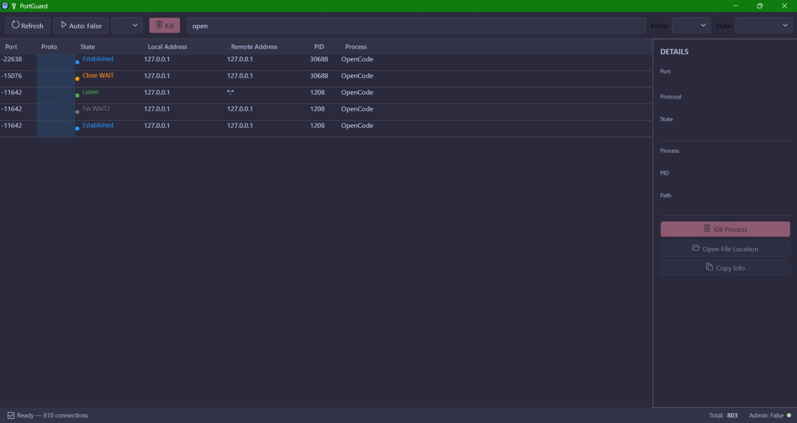

# 🔌 PortGuard

**Windows Port Manager with GUI** — inspect, filter, and manage all TCP/UDP network ports on your machine.

Built with .NET 9 and WPF, PortGuard uses the same Windows IP Helper API (`GetExtendedTcpTable`) as Microsoft's TCPView to give you a native, kernel-level view of every open port and its owning process.



## Features

- **Live port enumeration** — TCP, UDP, TCPv6, UDPv6 with state tracking (LISTEN, ESTABLISHED, TIME_WAIT, etc.)
- **Process ownership** — PID, process name, and executable path for every port
- **Kill processes** — terminate any process on any port (admin required for system processes)
- **Dark theme** — Catppuccin Mocha-inspired UI
- **Auto-refresh** — configurable polling interval (1s–30s) with live change detection
- **Filtering** — search by process name, port number, address, protocol, or connection state
- **Keyboard shortcuts** — F5 refresh, Del kill selected, F3 toggle auto-refresh
- **Detail panel** — expand any row to see full process info, memory, and executable path
- **Open file location** — jump to the process executable in Explorer
- **Admin elevation** — embedded manifest prompts UAC for full system process visibility

## Architecture

```
PortGuard.sln
├── PortGuard.Core/          # Domain models, abstractions, services
│   ├── Models/              # PortEntry, ProcessInfo, ProtocolType, PortState
│   ├── Abstractions/        # IPortEnumerator, IProcessKiller, IPortMonitor
│   └── Services/            # ProcessKiller, ProcessInfoResolver, PortMonitor
├── PortGuard.Windows/       # Windows-specific P/Invoke layer
│   ├── Interop/             # DllImport declarations (iphlpapi.dll)
│   ├── Structs/             # MIB_TCPROW_OWNER_PID, MIB_UDPROW_OWNER_PID
│   └── NativePortEnumerator # IP Helper API implementation
├── PortGuard.App/           # WPF MVVM UI
│   ├── ViewModels/          # MainViewModel, PortEntryViewModel, RelayCommand
│   ├── Views/               # MainWindow, DetailPanel
│   ├── Converters/          # Value converters for data binding
│   └── Assets/              # Icons
└── PortGuard.Tests/         # xUnit tests
```

### Dependency Flow

```
App → Core ← Windows
```

Core has no UI or platform dependencies. The Windows project implements Core abstractions via P/Invoke.

## Tech Stack

| Layer | Technology |
|-------|-----------|
| UI | WPF (.NET 9) with MVVM |
| Port enumeration | `iphlpapi.dll` — `GetExtendedTcpTable`, `GetExtendedUdpTable` |
| Process management | `System.Diagnostics.Process` + `OpenProcess`/`TerminateProcess` via P/Invoke |
| Testing | xUnit |

## Build & Run

### Prerequisites

- [.NET 9 SDK](https://dotnet.microsoft.com/download/dotnet/9.0)
- Windows 10/11

### Build

```bash
git clone https://github.com/8u9i/PortGuard.git
cd PortGuard
dotnet build
```

### Run

```bash
# From source:
dotnet run --project src/PortGuard.App

# Or launch the built EXE (requires admin for full functionality):
src/PortGuard.App/bin/Debug/net9.0-windows/PortGuard.App.exe
```

### Publish (single-file executable)

```bash
dotnet publish src/PortGuard.App -c Release -r win-x64 --self-contained -o ./publish
```

## License

MIT
